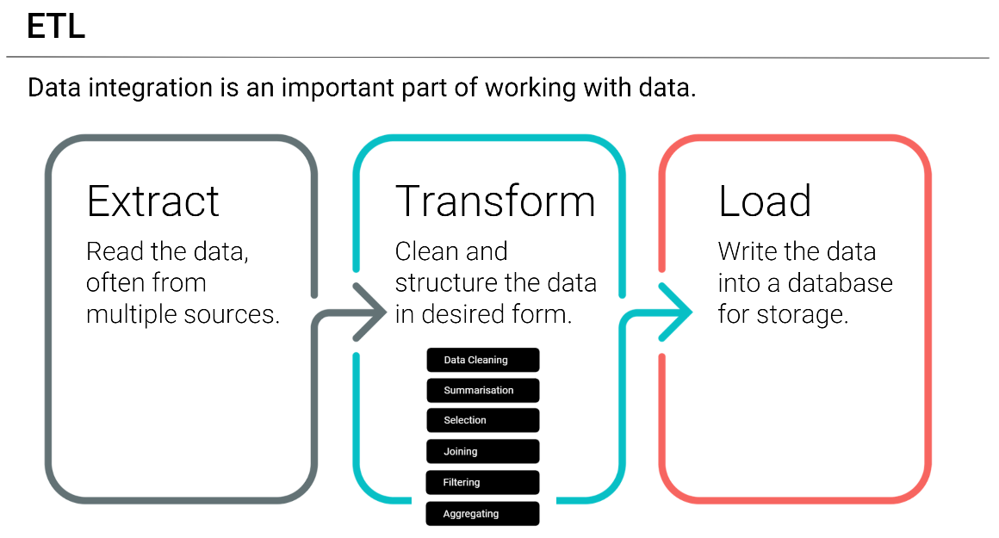

# English Premier League (EPL) ETL Project
Week 13 - Group 7

ENTER TEXT HERE


## Assignment structure
```
ETL-Project
| 
|__ images/          
|   |__ epl_dreamteam_cover
|   |__ ETL.PNG
|   |__ ETL_NewParadigm.PNG
|
|__ Resources/
|   |__ EPL_QuickDBD.sql
|   |__ pl_15-16.csv
|   |__ pl_16-17.csv
|   |__ pl_17-18.csv
|   |__ pl_18-19.csv
|   |__ Player_complete_nationality.csv
|   |__ Player_Stats.csv
|
|__ .gitignore 
|__ EPL_csv_cleanup.ipynb
|__ EPL_html_GetRequest.ipynb
|__ README - Project Guidelines.md
|__ README - Project Proposal.md
|__ README.md
| 

```

## Usage

```
# Dependencies and Setup

from bs4 import BeautifulSoup

import pandas as pd
import numpy as np
import requests

```


## Data Sources:

|No|Source|Link|
|-|-|-|
|1|Kaggle|https://www.kaggle.com/krishanthbarkav/english-premier-leagueepl-player-statistics|
|2|Scrape/API|https://fbref.com/en/comps/9/stats/Premier-League-Stats|


## Datasets 

|No|Source|Link|
|-|-|-|
|1|pl_15-16.csv|https://github.com/alysnow/sql-challenge/blob/main/data/departments.csv|
|2|pl_16-17.csv|https://github.com/alysnow/sql-challenge/blob/main/data/dept_emp.csv|
|3|pl_17-18.csv|https://github.com/alysnow/sql-challenge/blob/main/data/dept_manager.csv|
|4|pl_18-19.csv|https://github.com/alysnow/sql-challenge/blob/main/data/employees.csv|
|5|Player_complete_nationality.csv|https://github.com/alysnow/sql-challenge/blob/main/data/salaries.csv|
|6|Player_Stats.csv|https://github.com/alysnow/sql-challenge/blob/main/data/titles.csv|


## ETL Task Breakdown:



1. Research
2. Acquire datasets
3. Clean datasets
    * Excel
    * Jupyter notebook
4. Create database SQL
    * Create tables
    * Create a view to join tables
    

## Extract:


### Data:


## Transform:


## Load:


### Entity Relationship Model:

Inspect the CSVs and sketch out an ERD of the tables.


The ERD was generated using the QuickDBD tool in the following link; http://www.quickdatabasediagrams.com

### Data Engineering:

Utilizing the QuickDBD tool to generate the ERD, the table schema for each of the CSV files is assembled including the data types, primary keys, foreign keys, and any other constraints. All csv files are imported into the subsequent SQL table. A copy of the table schema is located in the following link;

https://github.com/alysnow/sql-challenge/blob/main/EmployeeSQL/table_schema.sql


### Data Analysis:


### Report:


    
## Contributors
- [@Alysha](https://github.com/alysnow)
- [@Ernest](https://github.com/KenyanBoy)