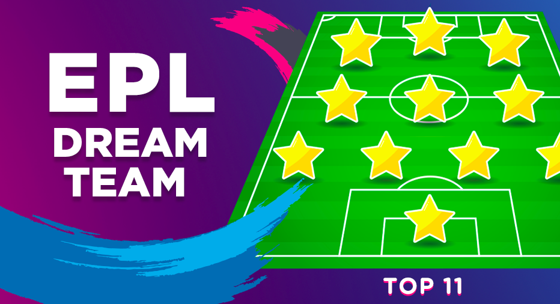

# English Premier League (EPL) ETL Project
Week 13 - Group 7



This Project aims to Utilise EPL Player stats to build an EPL Dream team. By gathering multiple dataset statistics, the objective is to analyse, dissect and extract the important data to be readily available for useful application.


## Assignment structure
```
ETL-Project
| 
|__ images/          
|   |__ epl_dreamteam_cover
|   |__ ERDModel.png
|   |__ ETL.PNG
|   |__ ETL_NewParadigm.PNG
|
|__ Resources/
|   |__ OriginalData/
|      |__ pl_15-16.csv
|      |__ pl_16-17.csv
|      |__ pl_17-18.csv
|      |__ pl_18-19.csv
|   |__ defender_average.csv
|   |__ forward_average.csv
|   |__ goalkeeper_average.csv
|   |__ midfielder_average.csv
|   |__ Player_complete_nationality.csv
|   |__ Player_Stats.csv
|   |__ player_stats_complete.csv
|
|__ SQL/
|   |__ epl_table_schema.sql
|
|__ .gitignore 
|__ EPL_csv_cleanup.ipynb
|__ EPL_html_GetRequest.ipynb
|__ Project Report - Group 7.docx
|__ README - Project Guidelines.md
|__ README - Project Proposal.md
|__ README.md
| 

```

## Usage

```
# Dependencies and Setup

from bs4 import BeautifulSoup
from sqlalchemy import create_engine

import pandas as pd
import numpy as np
import requests

```


## Data Sources:

|No|Source|Link|
|-|-|-|
|1|Kaggle|https://www.kaggle.com/krishanthbarkav/english-premier-leagueepl-player-statistics|
|2|Scrape/API|https://fbref.com/en/comps/9/stats/Premier-League-Stats|


## Datasets 

|No|Source|Link|
|-|-|-|
|1|pl_15-16.csv|https://github.com/alysnow/ETL-Project/blob/main/Resources/OriginalData/pl_15-16.csv|
|2|pl_16-17.csv|https://github.com/alysnow/ETL-Project/blob/main/Resources/OriginalData/pl_16-17.csv|
|3|pl_17-18.csv|https://github.com/alysnow/ETL-Project/blob/main/Resources/OriginalData/pl_17-18.csv|
|4|pl_18-19.csv|https://github.com/alysnow/ETL-Project/blob/main/Resources/OriginalData/pl_18-19.csv|
|5|Player_Stats.csv|https://github.com/alysnow/ETL-Project/blob/main/Resources/Player_Stats.csv|
|6|Player_complete_nationality.csv|https://github.com/alysnow/ETL-Project/blob/main/Resources/Player_complete_nationality.csv|
|7|defender_average.csv|https://github.com/alysnow/ETL-Project/blob/main/Resources/defender_average.csv|
|8|forward_average.csv|https://github.com/alysnow/ETL-Project/blob/main/Resources/forward_average.csv|
|9|goalkeeper_average.csv|https://github.com/alysnow/ETL-Project/blob/main/Resources/goalkeeper_average.csv|
|10|midfielder_average.csv|https://github.com/alysnow/ETL-Project/blob/main/Resources/midfielder_average.csv|
|11|player_stats_complete.csv|https://github.com/alysnow/ETL-Project/blob/main/Resources/player_stats_complete.csv|


## ETL Task Breakdown:


1. Research
2. Acquire datasets
3. Clean datasets
    1. Jupyter notebook
4. Create database SQL
    1. Create tables
    2. Create a view to join tables


## Entity Relationship Model:


The ERD model was generated using the QuickDBD tool in the following link; http://www.quickdatabasediagrams.com

## Report

A copy of the Project report is located in the following link; https://github.com/alysnow/ETL-Project/blob/main/Project%20Report%20-%20Group%207.docx

## Contributors
- [@Alysha](https://github.com/alysnow)
- [@Ernest](https://github.com/KenyanBoy)